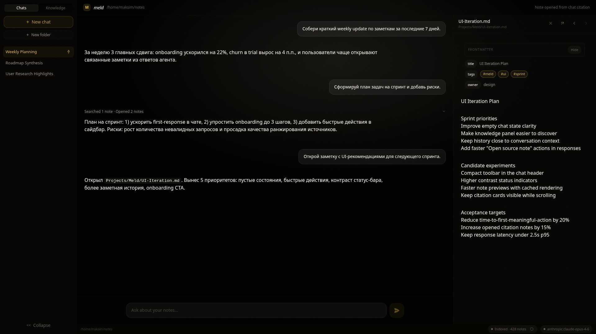

<p align="center">
  
</p>

<h1 align="center">meld</h1>

<p align="center">
  <strong>Superpersonalized AI agent that shares a knowledge base with you.</strong><br>
  Local-first. Open source. Works with Obsidian, Logseq, or any Markdown folder.
</p>

<p align="center">
  <a href="https://github.com/kizz-tech/meld/releases"></a>
  <a href="https://github.com/kizz-tech/meld/stargazers"></a>
  <a href="LICENSE"></a>
  <a href="https://github.com/kizz-tech/meld/releases"></a>
</p>

<p align="center">
  <a href="https://meld.kizz.me">Website</a> · <a href="https://github.com/kizz-tech/meld/releases">Download</a> · <a href="https://github.com/kizz-tech/meld/discussions">Discussions</a>
</p>

---

Most AI forgets you after every chat. meld doesn't.

You and AI share the same files — both read, write, and build on the same knowledge base. Point meld at your folder of Markdown notes. It indexes them, answers questions with source citations, creates new notes autonomously, and gets smarter from every interaction. Every AI edit is auto-committed to git so you can always roll back.

<p align="center">
  
</p>

## Why meld

| Problem | How meld solves it |
|---------|-------------------|
| Every AI chat starts from a blank slate | meld reads your existing notes — it already knows your context |
| AI-generated content disappears after the session | meld writes to real files on your disk — knowledge persists forever |
| You need 5 tools to capture, organize, search, connect, create | One agent does it all — ask a question, get an answer, it creates the note |
| AI tools require cloud sync and accounts | Everything stays on your machine. Bring your own API key |
| You can't trust AI edits | Git auto-commits before every change — undo anything, anytime |

## Features

- **Works with what you have** — Obsidian vaults, Logseq graphs, or any folder of `.md` files
- **Answers from your notes** — ask anything, get answers with clickable citations back to your files
- **Autonomous agent** — researches, creates, edits, and links notes without being asked
- **Web search** — optional Tavily integration to ground answers with live data
- **Nothing leaves your machine** — all data stays local, no cloud sync, no telemetry
- **Git safety net** — every change is auto-committed; undo anything from the UI
- **Bring your own key** — OpenAI, Anthropic, Google, or local Ollama
- **Tiny footprint** — cross-platform desktop app under 15 MB

## How it works

```
You: "What did we decide about the B2B pivot?"

meld: searches 847 notes → finds [[March Retro]], [[Pricing Research]],
      [[Customer Interviews Q4]] → answers with citations →
      auto-creates notes/b2b-pivot-analysis.md → git commits the change
```

1. **You ask** — natural language, any question about your knowledge
2. **It knows** — semantic search across your entire vault, grounded in your context
3. **It acts** — creates notes, connects ideas, builds on what exists

## Install

Download the latest release for your platform:

**[GitHub Releases](https://github.com/kizz-tech/meld/releases)**

| Platform | Format |
|----------|--------|
| Linux | `.AppImage`, `.deb` |
| macOS (Apple Silicon) | `.dmg` |
| macOS (Intel) | `.dmg` |
| Windows | `.msi`, `.exe` |

## Quick Start

1. Download and install meld
2. Open it and point to your Markdown folder (or create a new one)
3. Add an API key in Settings (OpenAI, Anthropic, Google, or set up Ollama)
4. Start chatting — meld indexes your notes automatically

## Privacy

- **API keys** stored locally in `~/.meld/config.toml` — never leave your device except to call your chosen provider
- **Your notes** stay on your machine — no cloud, no sync, no tracking, no telemetry
- **Git safety** — every vault write is auto-committed for full history and safe rollback
- **Open source** (AGPL-3.0) — audit the code yourself

## Comparison

| | meld | ChatGPT / Claude | Obsidian Copilot | Mem.ai | Khoj |
|---|---|---|---|---|---|
| Remembers your context | Persistent vault | Per-session only | Plugin-level | Cloud-only | Self-hosted |
| Your files, your disk | Local Markdown | Cloud | Local (plugin) | Cloud | Self-hosted |
| Autonomous note creation | Yes — agent writes | No | No | Limited | Limited |
| Git version control | Auto-commits | N/A | N/A | N/A | N/A |
| Open source | AGPL-3.0 | No | Partial | No | Yes |
| Works offline (Ollama) | Yes | No | No | No | Yes |
| Desktop app | Tauri (15 MB) | Web | Plugin | Web | Web |

## Tech Stack

Tauri 2.0 desktop app — Rust backend, Next.js frontend.

- **Core**: Agent state machine with safety budgets (iterations, tokens, time)
- **RAG**: `pulldown-cmark` → `sqlite-vec` (cosine similarity) → top-K context assembly
- **Storage**: SQLite + local Markdown files, git2 for version control
- **LLM**: OpenAI / Anthropic / Google (BYOK) or local Ollama
- **Tools**: MCP protocol — `kb_search`, `kb_read`, `kb_create`, `kb_update`, `kb_list`, `web_search`

---

## Development

### Prerequisites

- [Rust](https://rustup.rs/) (stable)
- [Node.js](https://nodejs.org/) (v22+)
- [pnpm](https://pnpm.io/)
- [Tauri prerequisites](https://v2.tauri.app/start/prerequisites/) for your OS

### Build & Run

```bash
pnpm install        # Install frontend dependencies
cargo tauri dev     # Run in development mode with hot reload
cargo tauri build   # Build production binary
```

### Test

```bash
cargo test --manifest-path src-tauri/Cargo.toml   # Rust tests
cargo clippy --manifest-path src-tauri/Cargo.toml  # Lint
pnpm lint                                          # ESLint
pnpm typecheck                                     # TypeScript
```

## Contributing

See [CONTRIBUTING.md](CONTRIBUTING.md) for setup, PR process, and code style.

## Security

See [SECURITY.md](SECURITY.md) for vulnerability reporting.

## License

[AGPL-3.0](LICENSE) — free to use, modify, and distribute. If you run a modified version as a service, you must open-source your changes.

---

<p align="center">
  Built by <a href="https://kizz.me">kizz</a> · <a href="https://x.com/my_kizzme">Follow on X</a> · <a href="https://github.com/sponsors/kizz-tech">Sponsor</a>
</p>
